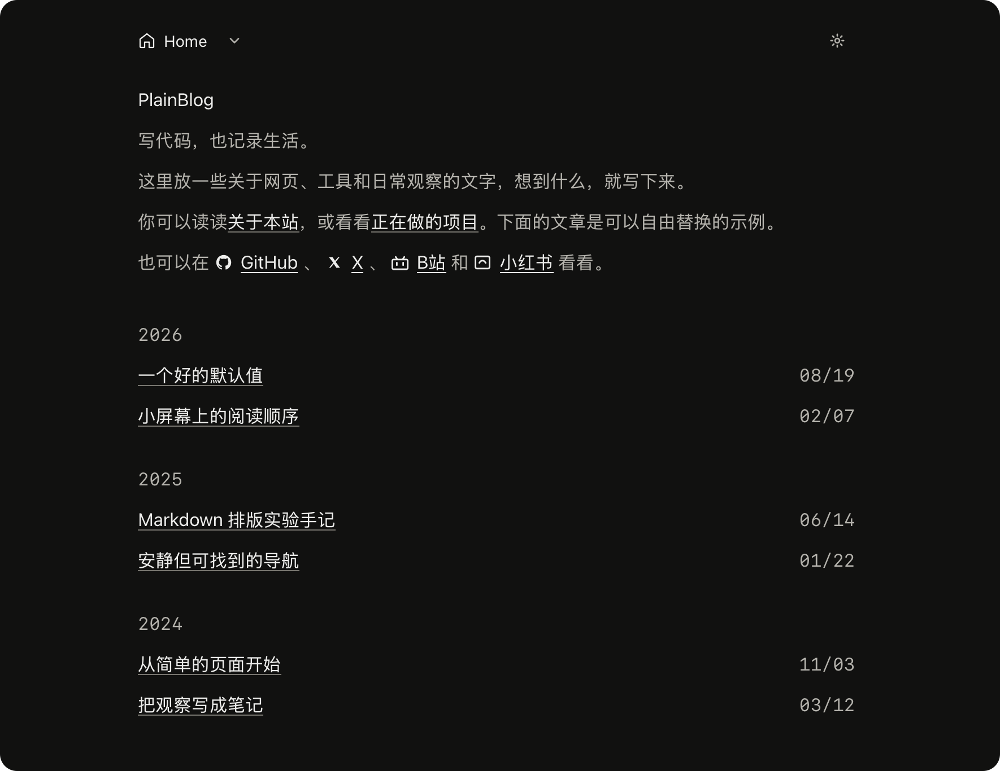

# PlainBlog

黑色极简静态博客，也可切换为白底。首页按年份列出文章，正文使用紧凑的 Markdown 排版；导航是无背景框的面包屑和按需展开的目录。主题灵感来源来自 https://hyoban.cc。

仓库里的文字和图片是可替换的演示内容。产品行为见 [规格](docs/SPEC.md)。



## 开始

需要 Node.js 22.12+ 和 pnpm 12.6（版本记录在 `package.json`）。

```sh
pnpm install
pnpm dev
```

打开终端给出的本地地址。检查与构建：

```sh
pnpm check
pnpm format
pnpm lint
pnpm test
pnpm build
pnpm preview
```

`pnpm test` 会先构建无站点 URL 的 HTML，再用 Node 测试内容规则与实际产物。失败构建和改名测试使用临时项目副本，不改写作者内容或当前 `dist/`。`pnpm format:write` 可格式化项目文件。`lint` 与 `check` 都运行 Astro 诊断，不是独立的 ESLint。

## 修改内容

- 编辑 `src/config.ts` 的站点名称、描述、下拉目录和首页社交地址。每条社交入口用 `icon` 字段指定图标，可用值见 `src/lib/social-icons.mjs`；现有 GitHub、X、B站、小红书指向各网站首页，发布前换成你自己的主页。Home 已固定在面包屑，不要再加入目录。新增独立页面时创建对应的 `src/pages/*.astro` 文件，再把入口加入导航数组；文章不需要加入目录。
- 在 `src/content/posts/` 新建单层、全小写 kebab-case 的 `.md` 文件，例如 `my-note.md`。Frontmatter 必须有非空 `title` 和引号包围的 `YYYY-MM-DD` 日期；正文从 `##` 开始。`draft: true` 会从首页和正文输出中排除；未写 draft 时默认公开。未来日期不会自动隐藏。
- 编辑 `src/content/pages/home.md` 修改首页介绍；`projects.md` 和 `about.md` 维护独立页面。页面标题由配置或对应 Astro 页面负责。
- `markdown-field-guide.md` 同时是 Markdown 渲染样例。若移除它，请把测试里的该路径换成保留的排版样例。新增普通文章不必修改测试清单。
- 文章配图放在 `src/assets/posts/<文章文件名>/`，用可读文件名，例如 ``。不要把图片放进 `src/content/posts/`，那里只放一层 Markdown。缺失的相对图片会让构建失败。

## 部署

执行 `pnpm build`，把 `dist/` 发布到静态站点根路径。生产域名确定后，在构建环境设置 `SITE_URL=https://your-domain.example/`（必须是绝对 HTTP(S) 地址），构建才会输出对应页面的 canonical；不设置时不输出 canonical。无需服务端、数据库或运行时环境变量。

配置主机把未知路径映射到 `dist/404.html`，并返回 HTTP 404。`/blog/` 没有汇总页面，也不会自动跳转。目录开关的原生功能不依赖 JavaScript。配色按钮会记住选择；没有 JavaScript 时跟随系统。订阅地址是 `/rss.xml`。它在每次构建时读取全部公开文章，新文章不用手改订阅源；草稿不会进入。设置 `SITE_URL` 后，订阅项和图片地址才会变成绝对链接。
